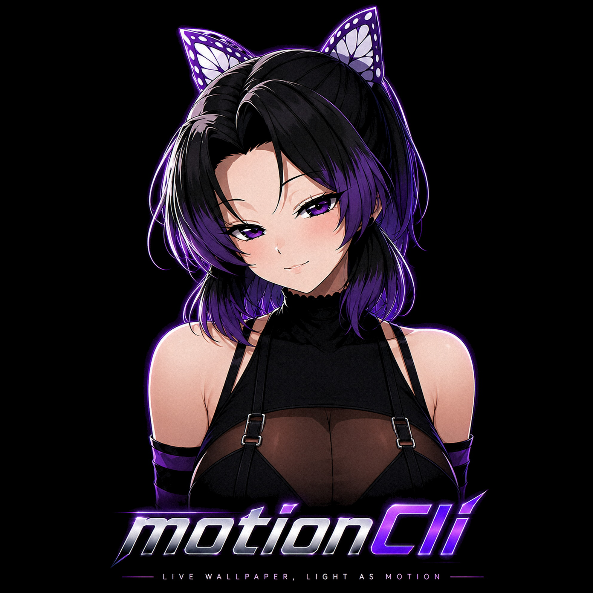

<p align="center">
  
</p>

<p align="center">
  
  
  
  
  
</p>

<p align="center">
  A super-lightweight live wallpaper engine for Windows.<br>
  Keyboard-navigable terminal UI. No Electron. No browser. Powered by native DirectX 11 hardware decoding and Media Foundation.
</p>

---

## Why Motion CLI?

| Tool | Per-wallpaper runtime | RAM usage | GPU Usage (Active) |
|------|----------------------|-----------|-------------------|
| Wallpaper Engine | Chromium webview | ~200-400 MB | ~5-15% |
| Lively Wallpaper | .NET + Chromium | ~150-300 MB | ~6-18% |
| **Motion CLI** | Native Direct3D 11 + MediaEngine | **~40-80 MB** | **< 1% (0% when paused)** |

One small detached process. Native GPU hardware-accelerated video decoding (NVDEC / Intel QuickSync / AMD VCN). No JS engine, no browser overhead, zero per-frame CPU churn.

## Features


---

## Getting Started

### Download

* **Universal Web Installer:** Download [`MotionCLI-Installer.exe`](https://github.com/RealTenzo/motioncli/releases/latest/download/MotionCLI-Installer.exe) from [Releases](https://github.com/RealTenzo/motioncli/releases). Automatically installs and sets up Start Menu + Desktop shortcuts and adds `motioncli` to your PATH.
* **Standalone Portable:** Download [`motioncli_portable.exe`](https://github.com/RealTenzo/motioncli/releases/latest/download/motioncli_portable.exe) from [Releases](https://github.com/RealTenzo/motioncli/releases). Run it directly anywhere — no install needed.

### Build from source

**Prerequisites:** Visual Studio 2022+ with C++ CMake tools, Windows 10/11 SDK.

**1-Click Build Script:**
```cmd
build_release.bat
```
Produces `dist/motioncli_portable.exe`, `dist/MotionCLI-Installer.exe`, and `dist/version.json` ready for release.

**Or via CMake directly:**
```bash
cmake -S . -B build -G "Visual Studio 17 2022" -A x64
cmake --build build --config Release
```

---

## Usage

```bash
motioncli
```

On first launch, a short guided intro walks you through everything.

### Main Menu

```
  Browse Library     ->  online library (search, categories, preview)
  My Wallpapers      ->  everything you've saved or imported
  Per-monitor setup  ->  assign different wallpapers to each screen
  Active Wallpaper   ->  stop, restart, mute the current wallpaper
  Settings           ->  performance, auto-pause mode, updates, autostart
  Quit
```

### Auto-Pause Modes

Under **Settings > Performance > Auto-pause mode** or right-clicking the **System Tray**:

| Mode | Behavior | Ideal Use Case |
|------|----------|----------------|
| **Maximized + Fullscreen** *(Default)* | Keeps playing while multitasking; pauses when an app (like browser) is maximized or fullscreen. | Best balance of aesthetics and GPU saving |
| **Fullscreen Only** | Keeps playing even behind maximized windows; pauses only in fullscreen games / videos. | Multi-monitor setups & transparent themes |
| **When any App is Focused** | Pauses whenever any non-desktop window is clicked. | Maximum battery saving |
| **Never Pause** | Constantly plays without pausing. | Visual showcase / dedicated wallpaper display |

### System Tray

Right-clicking the Motion CLI tray icon:

```
┌────────────────────────────────────────────────────────┐
│  Motion CLI · Live Wallpaper                           │
├────────────────────────────────────────────────────────┤
│  Open Motion CLI                                       │
│  [ ] Pause Wallpaper / [✓] Resume Wallpaper           │
│  [ ] Mute Audio                                        │
│  Auto-Pause Behavior  ▶  [✓] Maximized + Fullscreen    │
│                          [ ] Fullscreen Only           │
│                          [ ] When any App is Focused   │
│                          [ ] Never Pause (Always Play) │
├────────────────────────────────────────────────────────┤
│  Exit Motion CLI                                       │
└────────────────────────────────────────────────────────┘
```
* **Double-click Tray Icon**: Instantly opens and brings forward the Motion CLI TUI.

---

## Project Structure

```
motioncli/
  CMakeLists.txt            CMake build configuration
  build_release.bat         1-click release builder & packager
  version.json              Auto-update version manifest
  motion_logo.png           Application logo
  src/
    main.cpp                Entry point
    app/                    Application flow, menus, update popups
    core/                   Config, hardware detection, Direct3D 11 engine
    net/                    WinHTTP client, dynamic version.json updater
    tui/                    Terminal engine, ASCII art, in-console viewer
    util/                   JSON parser/serializer, string utilities
  resources/                App icons (.ico) and Windows resource scripts (.rc)
  installer/                Native Windows web installer and NSIS scripts
```

---

## Contributing

Contributions are welcome! Fork the repo, make your changes, and open a pull request.

If you fork this project, you **must** disclose that it is a fork:
> "Based on Motion CLI by tenzo (https://github.com/RealTenzo/motioncli)"

---

## Credits

Wallpapers are sourced from [MoeWalls](https://moewalls.com). All rights belong to their respective creators. Motion CLI is an independent client and is not affiliated with MoeWalls.

---

## License

MIT — (c) 2026 tenzo. See [LICENSE](LICENSE).
